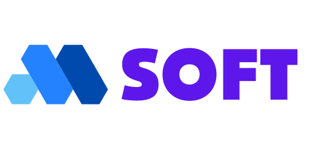

  

<h1 align="center">MSoftis | Information Systems</h1>

  <strong>Türkiye Merkezli Profesyonel Yazılım ve Tasarım Çözümleri Grubu</strong>

  
  
  

---

## 🚀 Hakkımızda

**MSoftis**, dijital dünyada yeni nesil çözümler üretmek amacıyla kurulmuş, Türkiye merkezli bir yazılım ve teknoloji grubudur. Vizyonumuzu, teknolojinin gücünü yaratıcılıkla birleştirerek iş ortaklarımıza yüksek katma değerli ürünler sunmak üzerine kurguluyoruz. 

Grafik tasarımdan oyun geliştirmeye, e-öğrenmeden simülasyon sistemlerine kadar çok geniş bir yelpazede, uçtan uca dijital dönüşüm hizmetleri sağlıyoruz.

---

## 🛠️ Çözüm Odaklı Hizmetlerimiz

MSoftis, aşağıdaki ana başlıklar altında profesyonel çözümler sunmaktadır:

### 🎨 Görsel Sanatlar & Tasarım
- **Grafik Tasarım:** Marka kimliği oluşturma, logo tasarımı ve kurumsal görsel stratejiler.
- **Masaüstü Yayıncılık:** Kitap, dergi ve dijital mecralar için profesyonel mizanpaj ve basım hazırlık süreçleri.

### 🌐 Web & İnternet Teknolojileri
- **Web Tasarımı:** Kullanıcı deneyimi (UX) odaklı, modern ve responsive tasarımlar.
- **İnternet Uygulamaları:** Karmaşık iş süreçlerini kolaylaştıran, ölçeklenebilir ve güvenli web tabanlı platformlar.

### 📱 Mobil & Oyun Geliştirme
- **Mobil Uygulamalar:** iOS ve Android platformları için yenilikçi ve hızlı yerel (native) veya hibrit çözümler.
- **Oyun Geliştirme:** Eğlence, eğitim (gamification) ve simülasyon odaklı yüksek kaliteli oyun projeleri.

### 🎓 Eğitim Teknolojileri (EdTech)
- **E-Öğrenme İçerik Geliştirme:** Etkileşimli eğitim modülleri, SCORM uyumlu içerikler ve LMS entegrasyonları.

### 🎬 Multimedya & Prodüksiyon
- **Dijital Ses ve Video Düzenleme:** Profesyonel kurgu, ses tasarımı, renk derecelendirme (color grading) ve post-prodüksiyon.
- **Animasyon ve Simülasyon:** 2D/3D animasyonlar, süreç simülasyonları ve teknik canlandırmalar.

---

## 💎 Neden MSoftis?

- **Bütüncül Yaklaşım:** Tasarım ve yazılım süreçlerini tek bir çatı altında birleştirerek tam uyumluluk sağlıyoruz.
- **Teknolojik Liderlik:** En güncel frameworkler, programlama dilleri ve tasarım trendlerini yakından takip ediyoruz.
- **Müşteri Odaklılık:** Projelerimizi iş ortaklarımızın spesifik ihtiyaçlarına ve hedeflerine göre özelleştiriyoruz.
- **Yerli Güç, Küresel Vizyon:** Türkiye merkezli operasyonlarımızla küresel standartlarda işler çıkarıyoruz.

---

## 📬 İletişim

Projeleriniz hakkında konuşmak veya iş birliği yapmak için bizimle iletişime geçebilirsiniz.

- **Web:** [msoftis.github.io/page](https://msoftis.github.io/page/)
- **GitHub:** [@msoftis](https://github.com/msoftis)

---

  <em>© 2026 MSoftis Information Systems. Tüm Hakları Saklıdır.</em>

